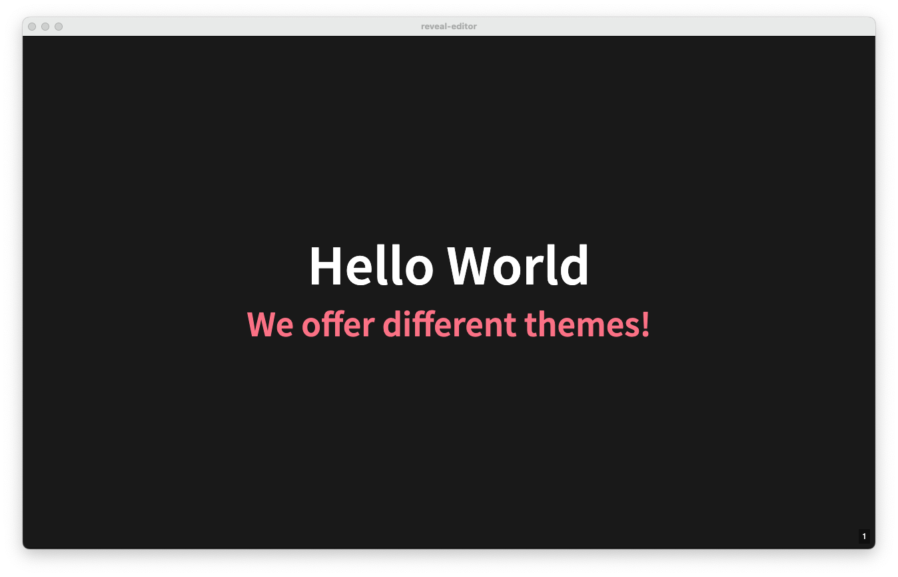
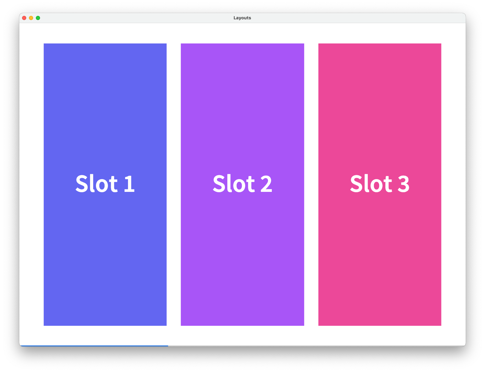

# Moonslide 🌛🛝


Moonslide is a markdown based presentation editor.

[](https://github.com/reveal-editor/reveal-editor/actions/workflows/ci.yml)

## Features ⚽️
-   **Markdown-based:** Write your presentation in Markdown with useful syntax extentions.
-   **Reveal.js under the hood:** Uses the power of Reveal.js to create stunning HTML presentations.
-   **Export Possibilities:** Export your presentation to HTML and PDF.
-   **Code Editor:** Write your presentation directly in the code editor of the program.
-   **Live Previews:** Your presentation is previewed at hot-reloaded as you write it.
-   **Templates & Themes:** Write custom templates and themes to configure the behaviour and looks of your presentations.
-   **Desktop Program:** Install Moonslide on the operating system of your choice.

## Installation 
Download the latest release [here](https://github.com/reveal-editor/reveal-editor/releases).

## Philosophy
There are two ways to use Moonslide. 
1. Use it as a normal person: Enjoy the convenience of the standard template, which provides you with everything you need to create stunning Markdown presentations.
2. Use it as a hacker: Create your own template and configure every aspect of your Reveal.js Presentation. You have control over basically everything! Use the standard template as a starting point.

## What is a Template?
A template is a folder which contains all relevant assets to generate the Reveal.js presentation from the Markdown presentation. It consists rougly of the following parts:
- The used Reveal.js distribution
- The definition of the available themes.
- The definition of the available layouts.
- Additional stylesheets with helper classes. 
- The configuration of the toolbar inside the app.

Take a look at the standard template **TODO**. If you want to create your own template, take a look at the section **TODO**. 

## Create your first Presentation
Presentations are written in Markdown. For every slide there is a configuration block written in YAML inside the seperators `---` similar to Front Matter. The following example shows the definition of two simple slides.
```yaml
---
layout: base
transition: zoom
---

# First Slide
## This is the first slide.

---
layout: cols-2
---

# Second Slide
```

## Markdown Syntax
In the Markdown-Blocks of the presentations, standard Markdown formatting options are supported. The [markdown-it](https://github.com/markdown-it/markdown-it) parser is used to parse the content. Some markdown extensions are used to add the possibility to style indiviual components.

### Slide and Slot Separators
The horizontal rule (`<hr>`) markers `---` and `***` have a special meaning when they are used at the start of a line. `---` marks the separation between a Markdown and a YAML block and splits the content up into indivdual slides. `***` seperates indiviual *slots* inside a slide. These are important when working with **TODO** layouts.

```yaml
---
layout: cols-2
---

## Slide 1 - Slot 1

***

## Slide 1 - Slot 2

---
layout: cols-3
---

## Slide 2 - Slot 1 

***

## Slide 2 - Slot 2

***

## Slide 2 - Slot 3
```


### Attributes
It is possible to apply any attributes like classes, styles or data tags to a block. Take a look at [markdown-it-attrs](https://github.com/arve0/markdown-it-attrs) for the whole documentation. Here are some examples how it works: 

```html
<!-- Add custom classes -->
# Heading { .first-class .second-class } 
<h1 class="first-class second-class">Heading</h1>

<!-- Add style and data attribute -->
## Red Roses { style="color: red;" data-rose="true" }
<h2 style="color: red;" data-rose="true">Red Roses</h2>

<!-- Inline Elements --> 
The roses are **red**{ .text-red }.
<p>The roses are <strong class="text-red">red</strong>.</p>
```

### Bracketed Spans
If an arbitrary text should be wrapped inside a span in order to style it, a bracketed span can be used. For this the extension [markdown-it-bracketed-spans](https://github.com/mb21/markdown-it-bracketed-spans) is used. Here are some examples how it works:

```html
<!-- Add class to part of heading -->
# Heading [Red]{ .text-red }
<h1>Heading <span class="text-red">Red</span></h1>

<!-- Don't add a space between brackets and braces -->
# Heading [Red] { .text-red }   
<h1 class="text-red">Heading [Red]</h1>
```

### Media 
Include images using the standard markdown syntax. 

```html
<!-- Include Local Image --->


<!-- Include Image via url --->

``` 

#### Block Level vs. Inline Images
If an image is the only item inside a pargraph it is transformed to a background-image of a `div`, so it fills out the container.  The CSS classes `image` and `image-block` are applied, which can be customized inside the template.

```html
<!-- Block Level Image --->

<div alt="house" style="background-image: url(./media/house.jpg);" class="image image-block"></div>
``` 

If there are other elements in the same paragraph, it is transformed to a normal `img` tag and the classes `image` and `image-inline` are applied.

 ```html
<!-- Inline Image --->
Image: 
Image: 
``` 

#### Videos
If the file extension is `.mp4`, `.mov` or `.vp9` it is parsed as a `<video>` tag. **TODO**

 ```html
<!-- Include Video --->

<video src="./media/nature.mp4" />
``` 

### Inline HTML
Use inline HTML at any point in your presentation.

```html
# My Markdown Heading
<h2>My HTML Subheading</h2>
``` 

## Front Matter Configuration
### Presentation Configuration
In the Front Matter block of the first slide, there are some attributes which configure the whole presentation.

```yaml
---
# standard or ./path/to/your-template
template: standard 
# black or white (for standard template)
theme: black
# title and author of the presentation
title: My First Presentation
author: Markdown Enthusiast
# Apply default values for all slides (-> Slide Configuraton)
defaults: 
  transition: zoom
  layout: title-content
---
```

### Slide Configuration
There are configuration options which can be applied to every slide individually.

#### Layout
Every slide uses a layout to structure its contents in a certain way. Every layout has a number of *slots*, which are containers for your content. Use the slot-separator `***` to fill content into the next slot. Take a look at all layouts available in the standard template. **TODO**.

```yaml
---
# This layout splits the content in to two columns.
layout: cols-2
---

# Left Side 

***

# Right Side
```

#### Custom Classes 
Custom classes can be added to every slide. These classes are usually defined inside the template. The standard template comes with a lot of useful classes to style your slides with. In some cases it may be more useful to only style a custom element using the Markdown-Attributes Syntax **TODO: Link**.

```yaml
---
class:
  - position-center  # Centers the content vertically
  - text-center      # Centers the text horizontally
  - text-red         # Changes the text color to red 
---

# My Customized Heading
```

#### Reveal.js Data-Attributes
You can specify every other keyword on the slide, and it will be directly passed to the HTML-Elemnt of the slide as a data-tag. In this way a lot of features of Reveal.js can be used. E.g., `transition: slide` will be transformed to `data-transition="slide"`. These are some possible values, which are available in Reveal.js:

```yaml
---
transition: slide
background-transition: slide
transition-speed: fast

background-image: ./my-image.jpg 
background-video: ./my-video.mp4
background-opacity: 0.5
background-size: contain
background-position: center

auto-animate: true
---
```

> Note: Make sure to start local relative paths with `./` or `../`. The paths are automatically transformed and can not be recognized if just the filename is present (`my-image.jpg` does not work).

You can find more information under [Transition (Reveal.js)](https://revealjs.com/transitions/), [Backgrounds (Reveal.js)](https://revealjs.com/backgrounds/) and [Auto-Animate (Reveal.js)](https://revealjs.com/auto-animate/).

## Standard Template
There is a standard template that comes with Moonslide. This section present the most important parts of the template. You will find basically everything described here inside the different items of the toolbar, when the standard template is used in the presentation.

### Themes
There are two themes which you can choose from `black` and `white`. Every theme includes its own CSS stylesheets, which changes the apperance of the whole presentation.

| `theme: black` | `theme:white` |
|:--|:--|
|  |  |

### Layouts
The standard template offers 18 layouts grouped into four categories: 

- **`Base`**: The `base` layout is the default and consits of just one slot which fills the whole slide.
- **`Cols`**: Groups the content into vertical columns. Available layouts are `cols-2`, `cols-3` and `cols-4`.
- **`Grid`**: Groups the content into a grid with various amount of items. Available layouts are `grid-3`, `grid-3-right`, `grid-4`, `grid-5`, `grid-6`, `grid-7`, `grid-8` and `grid-9`. 
- **`Title`**: Groups the content into a title and a sublayout. Available layouts are `title-content`, `title-cols-2`, `title-cols-3`, `title-grid-3`, `title-grid-3-right` and `title-grid-4`.

Take a look at an example of every category:

| Layout | Image |
|:--|:--|
| `layout: base` |  |
| `layout: cols-3` |  |
| `layout: grid-3` |  |
| `layout: title-cols-2` |  |


### Helper Classes

## Create your own Template
- Menu: Create own template -> don't start from scratch
- Explain config.yml
- Toolbar
- block vs. inline images
