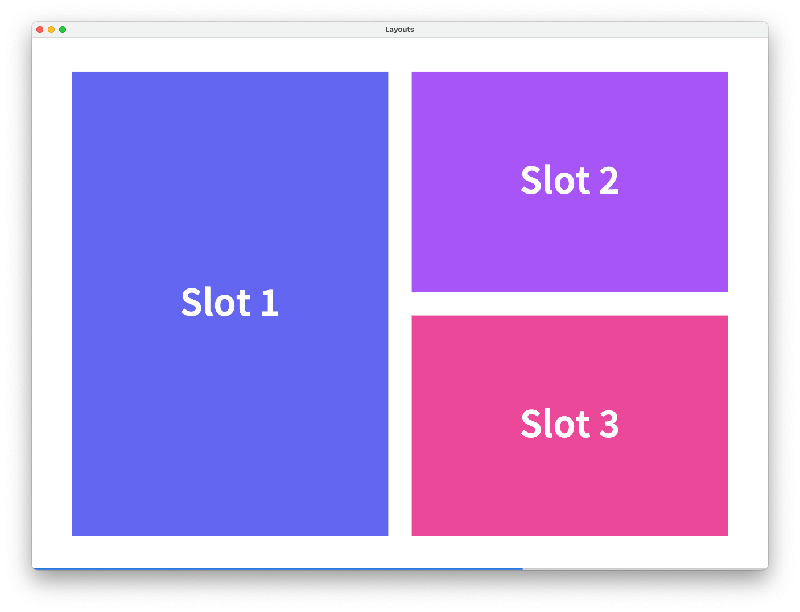

# Moonslide 🌛🛝


Moonslide is a markdown based presentation editor.

[](https://github.com/reveal-editor/reveal-editor/actions/workflows/ci.yml)

## Features 🎛
-   **📝 Markdown-based:** Write your presentation in Markdown with useful syntax extentions.
-   **🚀 Reveal.js under the hood:** Uses the power of [Reveal.js](https://revealjs.com/) to create stunning HTML presentations.
-   **🚪 Export Possibilities:** Export your presentation to HTML and PDF.
-   **⌨️ Code Editor:** Write your presentation directly in the code editor of the program.
-   **🎇 Live Previews:** Your presentation is previewed at hot-reloaded as you write it.
-   **🎨 Templates & Themes:** Write custom templates and themes to configure the behaviour and looks of your presentations.
-   **💻 Desktop Program:** Install Moonslide on the operating system of your choice.

## Demos & Installation 🤝🏼
Take a look at some [demos](./demo) and download the [latest release](https://github.com/reveal-editor/reveal-editor/releases).

## Table of Contents 🔦
- **[How it works 🔎](#how-it-works-)**
- **[What is a Template? 🤔](#what-is-a-template-)**
- **[Create your first Presentation 👩🏻‍🏫](#create-your-first-presentation-)**
- **[Markdown Syntax 📝](#markdown-syntax-)**
- **[Images and Videos 🌅](#images-and-videos-)**
- **[Animation 💫](#animation-)**
- **[Front Matter Configuration 🛠️](#front-matter-configuration-)**
- **[Standard Template 🎨](#standard-template-)**
- **[Create your own Template 🚧](#create-your-own-template-)**

## How it works 🔎
Moonslide is based on the presentation framework [Reveal.js](https://revealjs.com/). You write your presentation in Markdown and Moonslide automatically generates a Reveal.js HTML presentation. Most features of Reveal.js are also supported in Moonslide so it makes sense to have a look at the [Demo of Reveal.js](https://revealjs.com/) or to read their documentation. The [built-in plugins](https://revealjs.com/plugins/#built-in-plugins) of Reveal.js are also supported and included in the standard template.

### Usage
There are two ways to use Moonslide. 
1. **Use it as a normal person**: Enjoy the convenience of the standard template, which provides you with everything you need to create stunning Markdown presentations.
2. **Use it as a hacker**: Create your own template and configure every aspect of your Reveal.js Presentation. You have control over basically everything! Use the standard template as a starting point.

### Export Possiblilites
You can export your presentations as a Reveal.js HTML presentation or as a PDF.

## What is a Template? 🤔
A template is a folder which contains all relevant assets to generate the Reveal.js presentation from a Markdown file. It consists rougly of the following parts:
- The used Reveal.js distribution
- The definition of the available [themes](#themes).
- The definition of the available [layouts](#layouts).
- Additional stylesheets with [utility classes](#utility-classes). 
- The configuration of the applications toolbar.

The template can decide to present its functionality inside the different menus of the toolbar. In this way the features are easily accessible for all users. 

Take a look at the [standard template](#standard-template-). If you want to create your own template, take a look at [this section](#create-your-own-template-).

## Create your first Presentation 👩🏻‍🏫
Presentations are written in Markdown. For every slide there is a configuration block written in YAML inside the separators `---` similar to Front Matter. The following example shows the definition of two simple slides.
```yaml
---
layout: base
transition: zoom
---

# First Slide
## This is the first slide.

---
layout: cols-2
---

# Second Slide
```

## Markdown Syntax 📝
In the Markdown-Blocks of the presentations, standard Markdown formatting options are supported. We use the [markdown-it](https://github.com/markdown-it/markdown-it) parser to parse the content. Additionally, two markdown extensions are used to add the possibility to style indiviual elements.

### Slide and Slot Separators
The horizontal rule (`<hr>`) markers `---` and `***` have a special meaning when they are used at the start of a line. `---` marks the separation between a Markdown and a YAML block and splits the content up into indivdual slides. `***` seperates indiviual *slots* inside a slide. These are important when working with [layouts](#layout).

```yaml
---
layout: cols-2
---

## Slide 1 - Slot 1

***

## Slide 1 - Slot 2

---
layout: cols-3
---

## Slide 2 - Slot 1 

***

## Slide 2 - Slot 2

***

## Slide 2 - Slot 3
```


### Attributes
It is possible to apply any attributes like classes, styles or data tags to a block. Take a look at [markdown-it-attrs](https://github.com/arve0/markdown-it-attrs) for the whole documentation. Here are some examples how it works: 

```html
<!-- Add custom classes -->
# Heading { .first-class .second-class } 
<h1 class="first-class second-class">Heading</h1>

<!-- Add style and data attribute -->
## Red Roses { style="color: red;" data-rose="true" }
<h2 style="color: red;" data-rose="true">Red Roses</h2>

<!-- Inline Elements --> 
The roses are **red**{ .text-red }.
<p>The roses are <strong class="text-red">red</strong>.</p>
```

You find attributes provided by your template inside the toolbar menu `Styles`. 

### Bracketed Spans
If an arbitrary text should be wrapped inside a span in order to style it, a bracketed span can be used. For this the extension [markdown-it-bracketed-spans](https://github.com/mb21/markdown-it-bracketed-spans) is used. Here is an example how it works:

```html
<!-- Add class to part of heading -->
# Heading [Red]{ .text-red }
<h1>Heading <span class="text-red">Red</span></h1>

<!-- Don't add a space between brackets and braces -->
# Heading [Red] { .text-red }   
<h1 class="text-red">Heading [Red]</h1>
```

### Inline HTML
Use inline HTML at any point in your presentation.

```html
# My Markdown Heading
<h2>My HTML Subheading</h2>
``` 

## Images and Videos 🌅
Include images using the standard markdown syntax. 

```html
<!-- Include Local Image --->


<!-- Include Image via url --->

``` 

### Block Level vs. Inline Images
If an image is the only item inside a pargraph it is transformed to a background-image of a `div`, so it fills out the container.  The CSS classes `image` and `image-block` are applied, which can be customized inside the template.

```html
<!-- Block Level Image --->

<div alt="house" style="background-image: url(./media/house.jpg);" class="image image-block"></div>
``` 

If there are other elements in the same paragraph, it is transformed to a normal `img` tag and the classes `image` and `image-inline` are applied.

 ```html
<!-- Inline Image --->
Image: 
<p> Image:  </p>
``` 

### Background Images
If an image should fill the whole screen, you can add it inside the Front Matter Configuration under the keyword `background-image`. See [Reveal.js Data-Attributes](#revealjs-data-attributes) for more options.

```yaml
---
background-image: ./media/house.jpg
---
```

> Make sure to start relative paths with `./` or `../` inside a Front Matter Block. 

### Videos
Videos can be included using the Front Matter keyword `background-video`.

```yaml
---
background-video: ./media/nature.mp4
---
```

> Make sure to start relative paths with `./` or `../` inside a Front Matter Block. 

## Animation 💫
Animation on slides can be enabled by applying CSS classes to elements. Most features are based on Reveal.js [Fragments](https://revealjs.com/fragments/). The standard template also contains some additional useful classes. Take a look at the toolbar menu `Animation` to get an overview over the offered functionality. 

```yaml
---
---

# First Heading { .fragment }
## Second Heading { .fragment .fade-left }
### Third Heading { .fragment .strike }

```

## Front Matter Configuration 🛠️
### Presentation Configuration
In the Front Matter block of the first slide, there are some attributes which configure the whole presentation.

```yaml
---
# standard or ./path/to/your-template
template: standard 
# black or white (for standard template)
theme: black
# title and author of the presentation
title: My First Presentation
author: Markdown Enthusiast
# Apply default values for all slides (-> Slide Configuraton)
defaults: 
  transition: zoom
  layout: title-content
---
```

> The `defaults` are merged with the configuration of every individual slide. Every keyword which is defined on the slide directly will override the default value.

### Slide Configuration
There are configuration options which can be applied to every slide individually.

#### Layout
Every slide uses a layout to structure its contents in a certain way. Every layout has a number of *slots*, which are containers for your content. Use the slot separator `***` to fill content into the next slot. Take a look at the available [layouts](#layouts) of the standard template. You also find the available layouts inside the toolbar menu `+`, where you can directly insert a new slide with the chosen layout.

```yaml
---
# This layout splits the content into two columns.
layout: cols-2
---

# Left Side 

***

# Right Side
```

#### Custom Classes 
Custom classes can be added to every slide. These classes are usually defined inside the template. The standard template comes with a lot of useful classes to style your slides with. You can find the available styles inside the toolbar menu `Slide Styles`. In some cases it may be more useful to only style a custom element using the Markdown [attributes syntax](#attributes). 

```yaml
---
class:
  - position-center  # Centers the content vertically
  - text-center      # Centers the text horizontally
  - text-red         # Changes the text color to red 
---

# My Customized Heading
```

#### Reveal.js Data-Attributes
You can specify every other keyword on the slide, and it will be directly passed to the HTML-Elemnt of the slide as a data-tag. In this way a lot of Reveal.js features can be used. These are some possible values, which are available in Reveal.js. You can also find them inside the toolbar menu `Slide`.

```yaml
---
# Transition
transition: slide
background-transition: slide
transition-speed: fast

# Background
background-image: ./my-image.jpg 
background-video: ./my-video.mp4
background-opacity: 0.5
background-size: contain
background-position: center

# Animation
auto-animate: true
---
```

> Make sure to start relative paths with `./` or `../` inside a Front Matter Block. Otherwise they are not correctly recognized.

You can find more information under [Transition (Reveal.js)](https://revealjs.com/transitions/), [Backgrounds (Reveal.js)](https://revealjs.com/backgrounds/) and [Auto-Animate (Reveal.js)](https://revealjs.com/auto-animate/).

## Standard Template 🎨
There is a standard template that comes with Moonslide. This section presents the most important parts of the template. You will find basically everything described here inside the different items of the toolbar, when the standard template is used in the presentation.

### Themes
There are two themes which you can choose from: `black` and `white`. Every theme includes its own CSS stylesheets which change the apperance of the whole presentation.

| `theme: black` | `theme:white` |
|:--|:--|
|  |  |

### Layouts
The standard template offers 18 layouts grouped into four categories: 

- **`Base`**: The default `base` layout consists of just one slot which fills the whole slide.
- **`Cols`**: Groups the content into vertical columns. Available layouts are `cols-2`, `cols-3` and `cols-4`.
- **`Grid`**: Groups the content into a grid with various amount of items. Available layouts are `grid-3`, `grid-3-right`, `grid-4`, `grid-5`, `grid-6`, `grid-7`, `grid-8` and `grid-9`. 
- **`Title`**: Groups the content into a title and a sublayout. Available layouts are `title-content`, `title-cols-2`, `title-cols-3`, `title-grid-3`, `title-grid-3-right` and `title-grid-4`.

Take a look at an example of every category:

| | |
|:--|:--|
| `layout: base` | `layout: cols-3` |
|  |  |
| `layout: grid-3` | `layout: title-cols-2` |
|  |  |


### Utility  Classes
The standard template offers a range of utility CSS-classes. They are available in the toolbar menus `Style`, `Animation` and `Slide Styles`. Here is a list of the some utitliy classes (not nearly complete):

- **Vertical Position (`position-`)**: `top`, `center`, `bottom`
- **Text-Alignment (`text-`)**: `left`, `center`, `right`
- **Font-Size (`text-`)**: `xs`, `sm`, `base`, `lg`, `xl`, ...
- **Font-Color (`text-`)**: `main`, `white`, `black`, `red`,  `green`, `blue`, ...
- **Image (image-)**: `cover`, `contain`, `center`, ...
- **Width (w-)**: `full`, `half`, `0`, `1`, `2`, `3`, `4`, ...
- **Height (h-)**: `full`, `half`, `0`, `1`, `2`, `3`, `4`, ...
- **Margin (m-)**: `0`, `0.5`, `1`, `1.5`, `2`, `2.5`, `3`, ...

## Create your own Template 🚧
You can create your own template and use it in your presentation by specifying the path to your template folder in the Front Matter Configuration of the first slide.

```yaml
---
template: ./path/to/your-template-folder
---
```

Start off by selecting `Menu / File / Create Template`. This will copy the standard template to your desired location. This is important, because you probably don't want to start from scratch.

### The `config.yml` File
At the top-level of your template-directory, there has to be a `config.yml` file. It is the heart of the template and references all other needed files. 

> Be aware, that all files referenced in `config.yml` have to be inside the template folder.

Take a look at the standard templates `config.yml` file. Some entries are explained in more detail below.

```yaml
# Entry point script which must call `RevealEditor.configure()`.
entry: ./index.js
# Entry point script and stylesheet(s) of the reveal.js distribution.
reveal:
  entry: ./reveal_js/dist/reveal.js
  stylesheets: ./reveal_js/dist/reveal.css
# Additional stylesheets which are loaded after reveal and theme stylesheets.
stylesheets: ./styles/index.css
# Additional scripts which are loaded after the reveal entry script, but before the entry script
# This property is suitable to specify additional (reveal.js) plugins.
scripts:
  - ./reveal_js/plugin/highlight/highlight.js
  - ./reveal_js/plugin/math/math.js
  - ./reveal_js/plugin/search/search.js
  - ./reveal_js/plugin/zoom/zoom.js
# HTML file which allows to define a wrapper around all slides. 
# Must contain a `@@content@@` token where the slide content will be placed.
slide: ./slide.html
# Definition of themes which add additional stylesheets.
themes:
  - name: black
    default: true
    stylesheets:
      - ./reveal_js/dist/theme/black.css
      - ./styles/colors/black.css
      - ./styles/code/stackoverflow-dark.css
  - name: white
    stylesheets:
      - ./reveal_js/dist/theme/white.css
      - ./styles/colors/white.css
      - ./styles/code/stackoverflow-light.css
# Definition of layouts which are used to build the slides.
# Every layout must contain at least one `@@slot@@` token where the content is placed.
layouts:
  - name: base
    default: true
    path: ./layouts/base.html
  - name: cols-3
    path: ./layouts/cols-3.html
  - name: grid-3
    path: ./layouts/grid-3-left.html
  - name: title-cols-2
    path: ./layouts/title-cols-2.html
# For every section of the toolbar a separate file can be specified 
# which lists all items to show in this section
toolbar:
  layouts: ./toolbar/layouts.yml
  styles: ./toolbar/styles.yml
  animation: ./toolbar/animation.yml
  slide: ./toolbar/slide.yml
  slideStyles: ./toolbar/slideStyles.yml
```

### Entry Script (`entry`)
The specified entry script **must** initialize Reveal.js. Otherwise the presentations using your template will not be displayed. In a normal Reveal.js presentation, we would have to call [`Reveal.initialize()`](https://revealjs.com/initialization/). When using MoonSlide, you have to call `MoonSlide.initialize()` instead, so we can override some options for the live previews. The function calls are forwarded to the `Reveal` object, so the API is exactly the same as it is in Reveal.js. Here is an example entry script.

```js
Moonslide.initialize({ 
  controls: true,
  progress: true,
  history: true,
  plugins: [RevealHighlight, RevealMath]
})
```

Take a look at all [configuration options](https://revealjs.com/initialization/) of Reveal.js.

### Slide Customization (`slide`)
If you want to define a wrapper for all slides, e.g., to add a header or a footer to your presentations, you can provide a custom `slide.html` file. The contents of the file will be wrapped around every slide of the presentation individually. There has to be the token `@@content@@` inside the HTML-file, where the slides will be injected. Have a look at the `slide.html` file of the standard template, which can be used as a starting point to add a header or a footer.

```html
<div class="slide-wrapper">
    <!-- <div>Insert header here</div> -->
    @@content@@
    <!-- <div>Insert footer here</div> -->
</div>
```

### Define Layouts (`layouts`)
To define your own layout, just create a HTML-file with your layout and reference it inside `config.yml`. Put the token `@@slot@@` for every slot there is inside the layout. Take a look at the `cols-3.html` file, which defines the layout `cols-3` (with 3 slots).

```html
<div class="layout cols cols-3">
    <div class="slot">@@slot@@</div>
    <div class="slot">@@slot@@</div>
    <div class="slot">@@slot@@</div>
</div>
```

###  Toolbar Customization (`toolbar`)
The toolbar is useful to show the user what your template offers. **The toolbar does not configure the behaviour of the presentation in any way.** It just gives the user an easy way to interact with your template. The user can always use any attributes they like, even if they are not specified inside the toolbar.

#### Toolbar Menus

There are five customizable menus inside the toolbar:
- **`layouts`**: Lists all the layouts available inside your template. Don't confuse it with the top-level `layouts` property of `config.yml`. In this section you only choose, which values are displayed inside the toolbar.
- **`styles`**: Lists all styles, which can be applied to individual Markdown elements. When clicking them inside the toolbar, they will be inserted inside curly braces `{ .your-class }`. See Markdown [attribute syntax](#attributes).
- **`animation`**: Works the same way as `styles` and contains attributes concered with animation. 
- **`slide`**: Lists the [Reveal.js Data-Attributes](#revealjs-data-attributes) you support in your template. These can be included into the Front Matter configuration block and will automatically be transformed to data-attributes by the application.
- **`slideStyles`**: Lists classes, which can be applied to the whole slide. When selected they are inserted into the value of `class` inside the Front Matter Configuration. See [Custom Slide Classes](#custom-classes).

#### Configuration Files

The toolbar items are configured inside separate YAML files. The items are arranged into groups. Have a look at a small part of `styles.yml` from the standard template.

```yaml
- name: Text Alignment
  # Optional description
  description: Changes the horizontal alignment of a text. 
  items: 
    # The displayed name inside the toolbar.
  - name: Text Left
    # This it the text which is inserted.
    key: .text-left
    # Optional description
    description: ...
    # If set to `true` the item is only shown when the submenu is searched.
    hidden: true
  - name: Text Center
    key: .text-center
  - name: Text Right
    key: .text-right
```

> In this examples all keys start with a `.`. This is only the case because the values are inserted into Markdown using the [attribute syntax](#attributes). Inside `slideStyles.yml` where the values are inserted into Front Matter you would use the class names without `.`.

If you have utility classes with a lot of values, you can use the following syntax: 

```yaml
- name: Width
  items: 
    # Generated name with value.
  - name: Width ${{value}}
    # Generated key with value.
    key: .w-${{value}}
    # Sets the default values of all generated items.
    hidden: true
    # Specify all values to generate (string or number).
    values: [0, 1, 2, 3, 4, 5, 6, 7, 8, 9, 10, 11, 12, 14, 16, 20, 24, ..., 80, 96]
    # Sets `hidden` to `false` for the specified values.
    shownValues: [12, 20, 32, 40]
    # Sets `hidden` to `true` for the specified values.
    # (Makes no sense when hidden: true)
    hidddenValues: []
  - name: Half Width
    key: .w-half
    hidden: true
  - name: Full Width
    key: .w-full
```

> This will produce keys `.w-0`, `.w-1`, `.w-2`, ... with their corresponding names `Width 0`, `Width 1`, `Width 2`. All values are hidden except the four values specified inside `shownValues`.

The `values` can be strings or numbers. Strings are capitalized when inserted into the `${{value}}` placeholder of the `name`. As seen in the example, this syntax can be mixed with the normal definition of items like `.w-half` and `.w-full`.