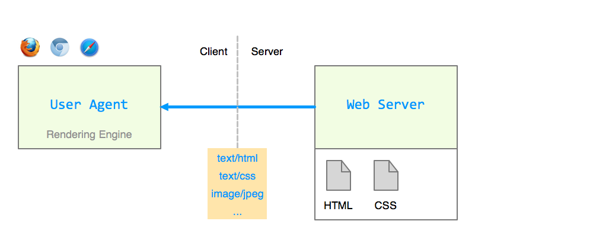
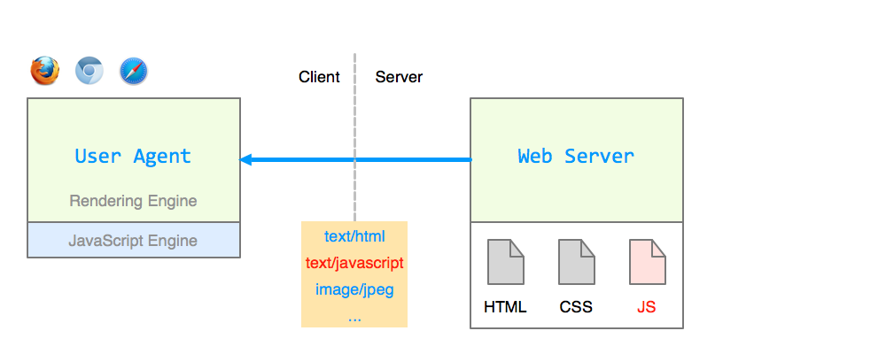

# [WBE]{.text-amber}: [Web-Entwicklung]{.text-blue}
# Einführung

---
class: position-center
---

## Übersicht

-   Worum geht’s in WBE? {.text-amber}
-   Organisatorisches
-   Internet und WWW
-   Client-Server-Architektur
-   Die Sprachen des Web: HTML, CSS, JavaScript
-   Web-Standards und APIs

---
---

## Worum geht's?

-   [Web-Technologien...?]{.text-blue}
    -   HTML, CSS, JavaScript
    -   Canvas, SVG, Geolocation, **DOM**, Websockets, uvm.
-   [Web-Platform...?]{.text-blue}
    -   Web-APIs und deren Einsatzmöglichkeiten
    -   z.B. Web-Apps, Electron-Apps, Webserver uvm.
-   [Web-Entwicklung...?]{.text-blue}
    -   Tools, Frameworks, Libraries

Das ist ein riesiges Gebiet! {.fragment .text-red .mt-10}

---

---

### Ziele WBE

-   JavaScript gut verstehen und einsetzten können
-   Nebenbei: HTML und CSS verstehen (Selbststudium) {.fragment}
-   Auswahl von Web-APIs kennen und einsetzen können {.fragment}
-   Eigenes kleines Web-Framework erstellen können {.fragment}
-   Klar ist: Das Vorhaben ist immer noch sehr ambitiös. {.fragment .text-amber .mt15}

---

---

### WBE

-   WBE wurde im HS20 zum ersten Mal durchgeführt
-   Ersetzt drei Kurse: WEB1, WEB2, WEB3
-   Komplett neu aufgebauter Kurs

Falls noch nicht alles ganz rund läuft:  
Beschwerden an xyz 😉 {.fragment .text-blue .mt-12}

---
layout: title-grid-3-right
---

# 3 Architekturen
***
### Architektur 1
 {.fragment .image-contain .image-top}
***
### Architektur 2
 {.fragment .image-contain .image-top}
***
### Architektur 3
 {.fragment .image-contain .image-top}

---
---

test